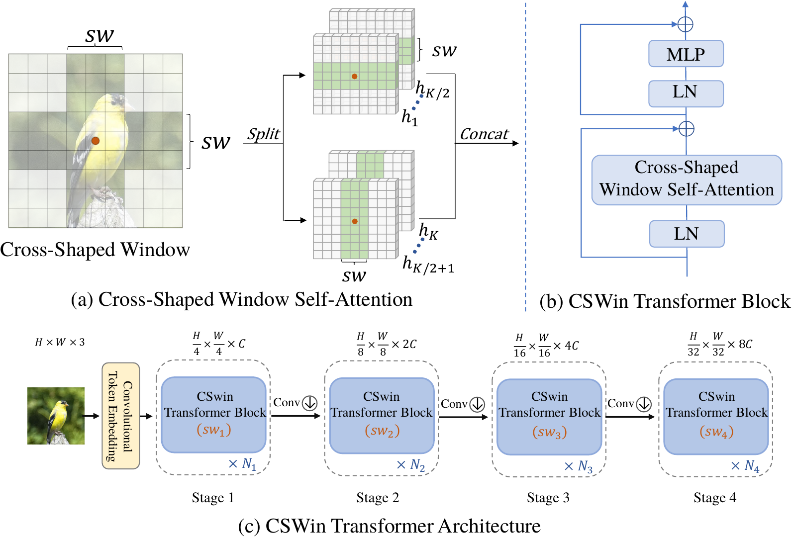

# CSWin-Transformer, CVPR 2022

[](https://paperswithcode.com/sota/semantic-segmentation-on-ade20k?p=cswin-transformer-a-general-vision)
[](https://paperswithcode.com/sota/semantic-segmentation-on-ade20k-val?p=cswin-transformer-a-general-vision)

This repo is the official implementation of ["CSWin Transformer: A General Vision Transformer Backbone with Cross-Shaped Windows"](https://arxiv.org/pdf/2107.00652.pdf). 

## Introduction

**CSWin Transformer** (the name `CSWin` stands for **C**ross-**S**haped **Win**dow) is introduced in [arxiv](https://arxiv.org/abs/2107.00652), which is a new general-purpose backbone for computer vision. It is a hierarchical Transformer and replaces the traditional full attention with our newly proposed cross-shaped window self-attention. The cross-shaped window self-attention mechanism computes self-attention in the horizontal and vertical stripes in parallel that from a cross-shaped window, with each stripe obtained by splitting the input feature into stripes of equal width. With CSWin, we could realize global attention with a limited computation cost.

CSWin Transformer achieves strong performance on ImageNet classification (87.5 on val with only 97G flops) and ADE20K semantic segmentation (`55.7 mIoU` on val), surpassing previous models by a large margin.



## Main Results on ImageNet

| model | pretrain | resolution | acc@1 | #params | FLOPs | 22K model | 1K model |
|:---:  | :---:    |  :---:     | :---: |   :---: | :---: |  :---:    |    :---: |
| CSWin-T | ImageNet-1K  | 224x224 | 82.8 | 23M  | 4.3G  |  -  | [model](https://github.com/microsoft/CSWin-Transformer/releases/download/v0.1.0/cswin_tiny_224.pth) | 
| CSWin-S | ImageNet-1k  | 224x224 | 83.6 | 35M  | 6.9G  |  -  | [model](https://github.com/microsoft/CSWin-Transformer/releases/download/v0.1.0/cswin_small_224.pth) |
| CSWin-B | ImageNet-1k  | 224x224 | 84.2 | 78M  | 15.0G |  -  | [model](https://github.com/microsoft/CSWin-Transformer/releases/download/v0.1.0/cswin_base_224.pth) |
| CSWin-B | ImageNet-1k  | 384x384 | 85.5 | 78M  | 47.0G |  -  | [model](https://github.com/microsoft/CSWin-Transformer/releases/download/v0.1.0/cswin_base_384.pth) |
| CSWin-L | ImageNet-22k | 224x224 | 86.5 | 173M | 31.5G | [model](https://github.com/microsoft/CSWin-Transformer/releases/download/v0.1.0/cswin_large_22k_224.pth)  | [model](https://github.com/microsoft/CSWin-Transformer/releases/download/v0.1.0/cswin_large_224.pth) |
| CSWin-L | ImageNet-22k | 384x384 | 87.5 | 173M | 96.8G |  -  | [model](https://github.com/microsoft/CSWin-Transformer/releases/download/v0.1.0/cswin_large_384.pth) |


## Main Results on Downstream Tasks

**COCO Object Detection**

| backbone | Method | pretrain | lr Schd | box mAP | mask mAP | #params | FLOPS |
|:---:     | :---:  |  :---:   | :---:   |   :---: | :---:    |   :---: | :---: |
| CSwin-T | Mask R-CNN | ImageNet-1K | 3x | 49.0 | 43.6 | 42M | 279G |
| CSwin-S | Mask R-CNN | ImageNet-1K | 3x | 50.0 | 44.5 | 54M | 342G |
| CSwin-B | Mask R-CNN | ImageNet-1K | 3x | 50.8 | 44.9 | 97M | 526G |
| CSwin-T | Cascade Mask R-CNN | ImageNet-1K |  3x | 52.5 | 45.3 | 80M | 757G |
| CSwin-S | Cascade Mask R-CNN | ImageNet-1K |  3x | 53.7 | 46.4 | 92M | 820G |
| CSwin-B | Cascade Mask R-CNN | ImageNet-1K |  3x | 53.9 | 46.4 | 135M | 1004G |

**ADE20K Semantic Segmentation (val)**

| Backbone | Method | pretrain | Crop Size | Lr Schd | mIoU | mIoU (ms+flip) | #params | FLOPs |
| :---: | :---: | :---: | :---: | :---: | :---: | :---: | :---: | :---: |
| CSwin-T | Semantic FPN | ImageNet-1K | 512x512 | 80K | 48.2 | - | 26M | 202G |
| CSwin-S | Semantic FPN | ImageNet-1K | 512x512 | 80K | 49.2 | - | 39M | 271G |
| CSwin-B | Semantic FPN | ImageNet-1K | 512x512 | 80K | 49.9 | - | 81M | 464G |
| CSwin-T | UPerNet | ImageNet-1K | 512x512 | 160K | 49.3 | 50.7 | 60M | 959G |
| CSwin-S | UperNet | ImageNet-1K | 512x512 | 160K | 50.4 | 51.5 | 65M | 1027G |
| CSwin-B | UperNet | ImageNet-1K | 512x512 | 160K | 51.1 | 52.2 | 109M | 1222G |
| CSwin-B | UPerNet | ImageNet-22K | 640x640 | 160K | 51.8 | 52.6 | 109M | 1941G |
| CSwin-L | UperNet | ImageNet-22K | 640x640 | 160K | 53.4 | 55.7 | 208M | 2745G |

pretrained models and code could be found at [`segmentation`](segmentation)

## Requirements

timm==0.3.4, pytorch>=1.4, opencv, ... , run:

```
bash install_req.sh
```

Apex for mixed precision training is used for finetuning. To install apex, run:

```
git clone https://github.com/NVIDIA/apex
cd apex
pip install -v --disable-pip-version-check --no-cache-dir --global-option="--cpp_ext" --global-option="--cuda_ext" ./
```

Data prepare: ImageNet with the following folder structure, you can extract imagenet by this [script](https://gist.github.com/BIGBALLON/8a71d225eff18d88e469e6ea9b39cef4).

```
│imagenet/
├──train/
│  ├── n01440764
│  │   ├── n01440764_10026.JPEG
│  │   ├── n01440764_10027.JPEG
│  │   ├── ......
│  ├── ......
├──val/
│  ├── n01440764
│  │   ├── ILSVRC2012_val_00000293.JPEG
│  │   ├── ILSVRC2012_val_00002138.JPEG
│  │   ├── ......
│  ├── ......
```

## Train

Train the three lite variants: CSWin-Tiny, CSWin-Small and CSWin-Base:
```
bash train.sh 8 --data <data path> --model CSWin_64_12211_tiny_224 -b 256 --lr 2e-3 --weight-decay .05 --amp --img-size 224 --warmup-epochs 20 --model-ema-decay 0.99984 --drop-path 0.2
```
```
bash train.sh 8 --data <data path> --model CSWin_64_24322_small_224 -b 256 --lr 2e-3 --weight-decay .05 --amp --img-size 224 --warmup-epochs 20 --model-ema-decay 0.99984 --drop-path 0.4
```
```
bash train.sh 8 --data <data path> --model CSWin_96_24322_base_224 -b 128 --lr 1e-3 --weight-decay .1 --amp --img-size 224 --warmup-epochs 20 --model-ema-decay 0.99992 --drop-path 0.5
```
If you want to train our CSWin on images with 384x384 resolution, please use '--img-size 384'.

If the GPU memory is not enough, please use '-b 128 --lr 1e-3 --model-ema-decay 0.99992' or use [checkpoint](https://pytorch.org/docs/stable/checkpoint.html) '--use-chk'.

## Finetune

Finetune CSWin-Base with 384x384 resolution:
```
bash finetune.sh 8 --data <data path> --model CSWin_96_24322_base_384 -b 32 --lr 5e-6 --min-lr 5e-7 --weight-decay 1e-8 --amp --img-size 384 --warmup-epochs 0 --model-ema-decay 0.9998 --finetune <pretrained 224 model> --epochs 20 --mixup 0.1 --cooldown-epochs 10 --drop-path 0.7 --ema-finetune --lr-scale 1 --cutmix 0.1
```

Finetune ImageNet-22K pretrained CSWin-Large with 224x224 resolution:
```
bash finetune.sh 8 --data <data path> --model CSWin_144_24322_large_224 -b 64 --lr 2.5e-4 --min-lr 5e-7 --weight-decay 1e-8 --amp --img-size 224 --warmup-epochs 0 --model-ema-decay 0.9996 --finetune <22k-pretrained model> --epochs 30 --mixup 0.01 --cooldown-epochs 10 --interpolation bicubic  --lr-scale 0.05 --drop-path 0.2 --cutmix 0.3 --use-chk --fine-22k --ema-finetune
```

If the GPU memory is not enough, please use [checkpoint](https://pytorch.org/docs/stable/checkpoint.html) '--use-chk'.


## Cite CSWin Transformer

```
@misc{dong2021cswin,
      title={CSWin Transformer: A General Vision Transformer Backbone with Cross-Shaped Windows}, 
        author={Xiaoyi Dong and Jianmin Bao and Dongdong Chen and Weiming Zhang and Nenghai Yu and Lu Yuan and Dong Chen and Baining Guo},
        year={2021},
        eprint={2107.00652},
        archivePrefix={arXiv},
        primaryClass={cs.CV}
}
```


## Acknowledgement

This repository is built using the [timm](https://github.com/rwightman/pytorch-image-models) library and the [DeiT](https://github.com/facebookresearch/deit) repository.

## License
This project is licensed under the license found in the LICENSE file in the root directory of this source tree.

[Microsoft Open Source Code of Conduct](https://opensource.microsoft.com/codeofconduct)

### Contact Information

For help or issues using CSWin Transformer, please submit a GitHub issue.

For other communications related to CSWin Transformer, please contact Jianmin Bao (`jianbao@microsoft.com`), Dong Chen (`doch@microsoft.com`).
